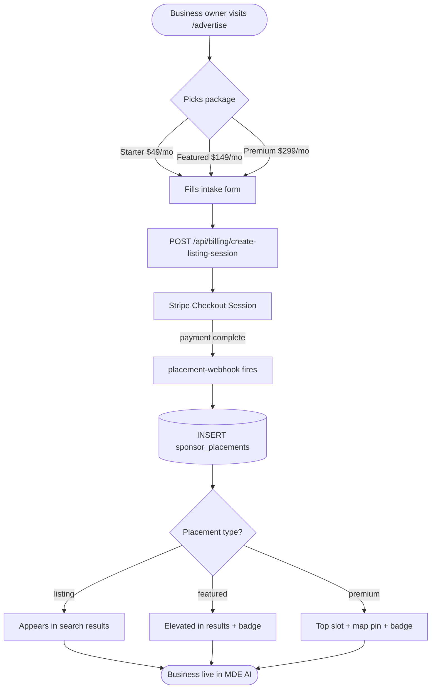
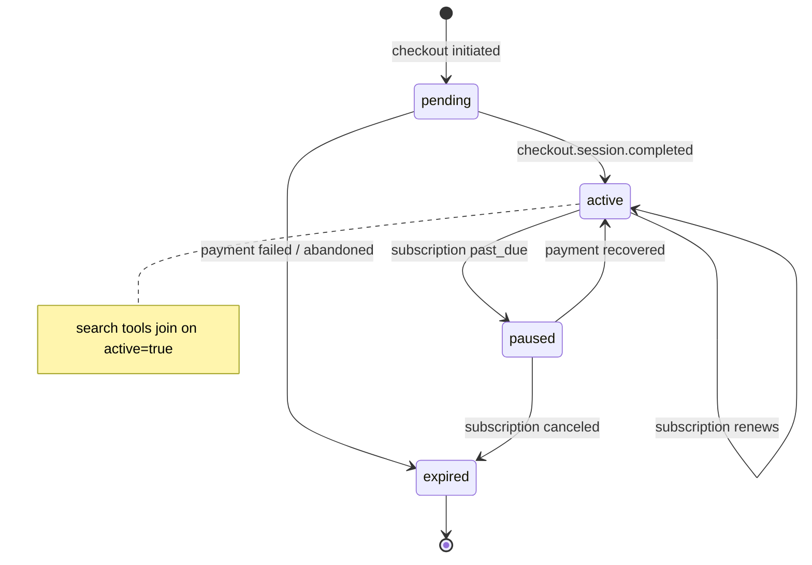

# C5 — /advertise Self-Serve Portal

## 0. Quick Read

**What this does in one sentence:** Any business in Medellín can visit `/advertise`, pick a listing package, pay with Stripe, and go live in MDE AI's discovery results within minutes — no email to the team, no waiting.

**What changes for each persona:**

| Persona | Before | After |
|---------|--------|-------|
| **Restaurant owner** | Emails the team to ask about advertising; waits days | Visits `/advertise`, picks "Starter Listing $49/mo", pays, live immediately |
| **Tourist** | Sees equally-ranked results with no curation signal | Featured listings have a badge; sponsored results labeled clearly |
| **Patricia** (ops) | No self-serve B2B revenue | `SELECT count(*), sum(amount) FROM sponsor_placements WHERE active = true` |
| **Camila** | Rental results based on data quality only | Featured properties can appear higher when their host subscribes |

**User journey — self-serve listing:**
1. Business owner visits `/advertise`
2. Scrolls to "Get Listed" section → picks a package (Starter / Featured / Premium)
3. Fills intake form (business name, category, neighborhood, website)
4. Clicks "Subscribe" → Stripe Checkout Session (subscription or one-time)
5. `placement-webhook` fires on `checkout.session.completed` → inserts `sponsor_placements` row
6. Listing goes live; search tools prioritize the placement





---

## 1. Purpose

MDE AI has a `sponsor.*` schema sitting dormant in Supabase — the tables exist but nothing writes to them and no discovery tool reads from them. C5 activates this schema by building a self-serve portal that lets any business buy a listing without involving the sales team.

C5 is **infrastructure** — it provides the `sponsor_placements` table and the checkout flow that:
- **C9** extends for restaurant monthly retainers
- **M5** (Sponsor Agent) uses to propose and manage placements autonomously

Distinct from **C1** (managed AI Marketing Agency — MDE AI team delivers content). C5 is purely self-serve: business pays, placement goes live, no human intervention.

**mde-stripe skill:** "Prefer Checkout Sessions for new flows." For monthly listings: `mode: 'subscription'`. For one-time placements: `mode: 'payment'`. Include `metadata: { vertical, business_category, neighborhood }` so the webhook can route correctly.

## 2. Goals

- `sponsor_advertisers` table: business profile linked to user
- `sponsor_placements` table: active placements with type, vertical, neighborhood, expiry
- `/advertise` page (C1 created agency section) — add "Get Listed" section with 3 listing packages
- `POST /api/billing/create-listing-session` route creates Stripe Checkout Session for selected package
- `placement-webhook` edge function handles `checkout.session.completed` → inserts `sponsor_placements` row
- `search-restaurants.ts` and `search-events.ts` updated to LEFT JOIN `sponsor_placements` and sort sponsored first
- `npm run build` exits 0; Vitest floor stays ≥ 401

## 3. Packages

| Package | Price | Placement type | Features |
|---------|-------|---------------|---------|
| Starter Listing | $49/mo | `listing` | Appears in search results; "Listed" badge |
| Featured Listing | $149/mo | `featured` | Top-3 in results; star badge; map highlight |
| Premium Placement | $299/mo | `premium` | #1 slot + featured map pin + chat-priority |

## 4. Wiring plan

### 4A — Schema

| Layer | File | Action |
|-------|------|--------|
| Migration | `supabase/migrations/YYYYMMDD_sponsor_placements.sql` | Create — see §5 |

### 4B — Checkout route

| Layer | File | Action |
|-------|------|--------|
| Route | `src/app/api/billing/create-listing-session/route.ts` | Create — POST; auth required; creates Stripe Checkout Session with `metadata: { placement_type, vertical, neighborhood, business_id }` |

```ts
// src/app/api/billing/create-listing-session/route.ts
import Stripe from 'stripe'
import { NextResponse } from 'next/server'
import { createClient } from '@/lib/supabase/server'

const stripe = new Stripe(process.env.STRIPE_SECRET_KEY!, {
  apiVersion: '2026-04-22.dahlia',
})

export async function POST(req: Request) {
  const supabase = await createClient()
  const { data: { user } } = await supabase.auth.getUser()
  if (!user) return NextResponse.json({ error: 'Unauthorized' }, { status: 401 })

  const { package: pkg, business_name, neighborhood, vertical } = await req.json()

  const priceMap: Record<string, string> = {
    starter:  process.env.STRIPE_PRICE_LISTING_STARTER!,
    featured: process.env.STRIPE_PRICE_LISTING_FEATURED!,
    premium:  process.env.STRIPE_PRICE_LISTING_PREMIUM!,
  }

  const session = await stripe.checkout.sessions.create({
    mode: 'subscription',
    line_items: [{ price: priceMap[pkg], quantity: 1 }],
    success_url: `${process.env.NEXT_PUBLIC_URL}/advertise?listing=success`,
    cancel_url:  `${process.env.NEXT_PUBLIC_URL}/advertise`,
    metadata: {
      placement_type: pkg,
      vertical,
      neighborhood,
      business_name,
      user_id: user.id,
    },
  })
  return NextResponse.json({ url: session.url })
}
```

### 4C — Webhook edge function

| Layer | File | Action |
|-------|------|--------|
| Webhook | `supabase/functions/placement-webhook/index.ts` | Create — handles `checkout.session.completed` with `metadata.placement_type`; inserts `sponsor_placements` |

```ts
// placement-webhook: on checkout.session.completed
if (event.type === 'checkout.session.completed') {
  const session = event.data.object as Stripe.Checkout.Session
  const meta = session.metadata ?? {}
  if (meta.placement_type && meta.user_id) {
    await serviceClient.from('sponsor_placements').insert({
      user_id: meta.user_id,
      business_name: meta.business_name,
      placement_type: meta.placement_type,   // 'listing' | 'featured' | 'premium'
      vertical: meta.vertical,
      neighborhood: meta.neighborhood,
      stripe_subscription_id: session.subscription as string,
      active: true,
      starts_at: new Date().toISOString(),
    })
  }
}
```

### 4D — Discovery integration

| Layer | File | Action |
|-------|------|--------|
| Restaurant tool | `src/mastra/tools/search-restaurants.ts` | Modify — LEFT JOIN `sponsor_placements` on venue; sort premium → featured → listing → organic |
| Events tool | `src/mastra/tools/search-events.ts` | Modify — same LEFT JOIN pattern for event promotions |

### 4E — UI

| Layer | File | Action |
|-------|------|--------|
| Page | `src/app/advertise/page.tsx` | Modify (C1 created) — add "Get Listed" section below agency packages |
| Component | `src/components/pricing/ListingPackageCard.tsx` | Create — package card with price, features, CTA |
| Intake form | `src/components/advertise/ListingIntakeForm.tsx` | Create — business name, category, neighborhood, website |

**CLAUDE.md note:** `/advertise` is `⚫ POST` in `sitemap.md` — C1 moves it to `🟡 MVP`; C5 ships its self-serve section on top.

## 5. Schema

```sql
-- supabase/migrations/YYYYMMDD_sponsor_placements.sql

CREATE TABLE public.sponsor_advertisers (
  id            uuid PRIMARY KEY DEFAULT gen_random_uuid(),
  user_id       uuid NOT NULL REFERENCES auth.users(id),
  business_name text NOT NULL,
  category      text,
  neighborhood  text,
  website       text,
  created_at    timestamptz NOT NULL DEFAULT now()
);
ALTER TABLE public.sponsor_advertisers ENABLE ROW LEVEL SECURITY;
CREATE POLICY "owner_read" ON public.sponsor_advertisers
  FOR SELECT USING (user_id = (SELECT auth.uid()));

CREATE TABLE public.sponsor_placements (
  id                     uuid PRIMARY KEY DEFAULT gen_random_uuid(),
  user_id                uuid REFERENCES auth.users(id),
  business_name          text NOT NULL,
  placement_type         text NOT NULL
    CHECK (placement_type IN ('listing', 'featured', 'premium')),
  vertical               text NOT NULL
    CHECK (vertical IN ('restaurant', 'event', 'venue', 'rental', 'tour')),
  neighborhood           text,
  stripe_subscription_id text,
  active                 boolean NOT NULL DEFAULT true,
  starts_at              timestamptz NOT NULL DEFAULT now(),
  ends_at                timestamptz,
  created_at             timestamptz NOT NULL DEFAULT now()
);
ALTER TABLE public.sponsor_placements ENABLE ROW LEVEL SECURITY;

-- Public read — advertiser identity is public (business name, neighborhood, category)
CREATE POLICY "public_read_active" ON public.sponsor_placements
  FOR SELECT USING (active = true);

-- Owner reads all their own rows (including inactive)
CREATE POLICY "owner_read_all" ON public.sponsor_placements
  FOR SELECT USING (user_id = (SELECT auth.uid()));
```

## 6. Edge cases

- **Existing `sponsor.*` tables:** If Supabase already has `sponsor.placements` in a `sponsor` schema, create `public.sponsor_placements` as a new table (do not modify the legacy schema — it may be used by the legacy app). Add a `TODO: reconcile with sponsor.* schema in Phase 2` comment in the migration.
- **Cancellation:** When `customer.subscription.deleted` fires, set `sponsor_placements.active = false` and `ends_at = now()`.
- **Multiple placements per user:** Allowed — a restaurant could have both a Featured Listing and a Premium Placement in different neighborhoods. The LEFT JOIN in search tools must handle multiple matching rows; `ORDER BY placement_type_rank DESC LIMIT 1` per venue.
- **Neighborhood targeting:** For Phase 1, `neighborhood` is a free text field. Phase 2 can add a lookup against `places.neighborhood` enum.
- **`STRIPE_PRICE_LISTING_*` env vars:** Must be added to `.env.local` and Vercel/Supabase secrets. Add them to the `.env.local` template in CLAUDE.md or a secrets checklist.

## 7. Real-world examples

**Tacos y Tequila owner** visits `/advertise`, scrolls to "Get Listed," picks Featured Listing ($149/mo). Enters business name + "El Poblado" neighborhood. Clicks "Subscribe." Stripe Checkout opens, he pays. `placement-webhook` inserts a `sponsor_placements` row with `placement_type: 'featured'`. Next time a tourist asks the concierge for dinner in Poblado, Tacos y Tequila appears in the top-3 with a ⭐ badge.

**Patricia** queries: `SELECT business_name, placement_type, neighborhood FROM sponsor_placements WHERE active = true ORDER BY placement_type DESC` — advertiser report.

## 8. Acceptance criteria

1. `sponsor_placements` and `sponsor_advertisers` tables exist with RLS policies.
2. `GET /advertise` renders 3 listing package cards (Starter / Featured / Premium) below agency packages.
3. `POST /api/billing/create-listing-session` with valid auth returns `{ url: "https://checkout.stripe.com/..." }`.
4. `placement-webhook` inserts a `sponsor_placements` row on `checkout.session.completed` with listing metadata.
5. `search-restaurants.ts` returns featured restaurants before non-featured when `sponsor_placements` has an active row.
6. `npm run build` exits 0; Vitest floor stays ≥ 401.

## 9. Outcomes

| | Before | After |
|---|---|---|
| `sponsor.*` schema | Dormant | Active — writes on every checkout |
| B2B self-serve revenue | Zero | $49–$299/mo per listing subscriber |
| Discovery ranking | Data quality only | Sponsored + featured placements elevate listings |
| C9 / M5 unblock | Blocked | `sponsor_placements` table + checkout flow ready |
