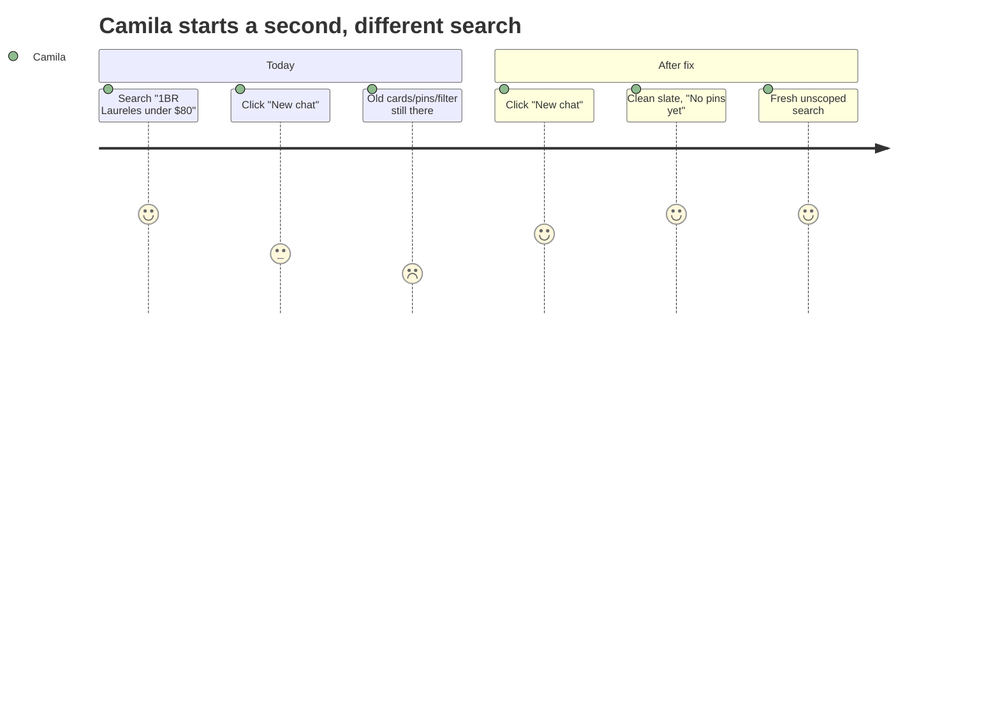
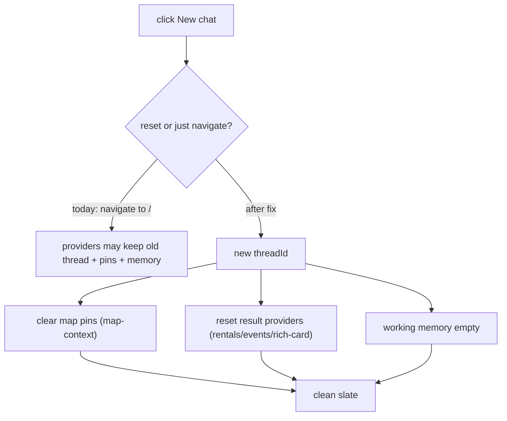

# UX-006 — Make "New chat" reset thread, working memory, results, and map pins

## Plain-English problem

Clicking **"New chat"** should give a clean slate. Today it's just a link to `/`, and within the single-page app that can leave the previous conversation, the result cards, the carried filters (working memory), and the old map pins hanging around. The user expects "start over" but gets "same session with the old stuff still there."

## User impact

- **Camila** finishes one rental search, hits New chat to start a different one, and is confused to see the old cards/pins or her old "1 BR" filter still applied (compounds the sticky-filter confusion noted in the UX audit F-6).
- **Tourist** can't cleanly switch topics. A stale map undermines trust in what's currently being shown.

## Persona affected

**Camila** and **Tourist** — anyone who runs more than one query per visit.

## Root cause

**KNOWN (state not reset on nav).** Per the codebase map:

- "New chat" = `mdeapp/src/components/chat/chat-nav-rail.tsx:24-30`, `href="/"` — a client navigation, not a state reset.
- Chat thread lives in CopilotKit's internal message store (keyed by thread/resource id); **working memory** is persisted in Mastra storage and read client-side via `useCoAgent<ConciergeWorkingMemory>()`.
- **Map pins** live in `useMapContext()` (`src/platform/maps/map-context.tsx`).
- **Result cards** live in the providers `GeoChatShell` wraps (`RentalUiProvider`, `RentalFastPathProvider`, `EventSearchResultsProvider`, `RichCardResultsProvider`, `EventLocalChatProvider` — `src/components/chat/geo-chat-shell.tsx:38-81`).

Navigating to `/` doesn't guarantee any of these are cleared/re-initialized.

## Files likely involved

| File | Change |
|------|--------|
| `mdeapp/src/components/chat/chat-nav-rail.tsx` | Turn "New chat" into a handler that resets state (or forces a fresh thread) rather than a bare link |
| `mdeapp/src/platform/maps/map-context.tsx` | Expose/​call a `clearPins()`/reset |
| The result providers in `geo-chat-shell.tsx` | Expose reset methods (clear rentals/events/rich-card results) |
| CopilotKit thread handling | Start a new `threadId` (so working memory doesn't carry) — confirm the 1.55.2 API for resetting a thread |

## Tech stack involved

CopilotKit 1.55.2 (thread/message reset, `useCoAgent` working memory) · React context (map + result providers) · Google Maps AdvancedMarkers (pin clearing — overlaps UX-007) · Next.js navigation · TypeScript.

## Skills to load

`copilotkit` (thread reset + working-memory semantics in 1.55.2), `mde-maps` (clear pins/markers cleanly), `testing`, `mde-task-lifecycle`.

## Implementation steps

1. Decide the reset mechanism with the `copilotkit` skill: either (a) start a brand-new `threadId` so CopilotKit mounts a fresh empty thread, or (b) call CopilotKit's message-reset plus clear the providers. (a) is cleaner because it also drops the carried working memory.
2. On "New chat": generate/assign a new thread id, clear map pins (`map-context`), and reset the result providers (rentals/events/rich-card).
3. Ensure the greeting/empty state re-renders ("No pins yet"), and no old assistant messages remain.
4. Coordinate pin clearing with UX-007 so there are no residual `gmp-advanced-marker` DOM nodes after reset.
5. Keep it a single user action — no confirmation dialog needed.

## Tests required

- **Playwright (e2e):** run "1BR in Laureles under $80/night" (5 cards + 5 pins) → click New chat → assert: zero chat messages beyond the greeting, zero result cards, map shows "No pins yet" / zero markers, and the carried `minBedrooms` filter is gone (a subsequent vague query is not silently scoped to "1 BR").
- **Vitest:** provider reset methods clear their state.

## Acceptance criteria

- [ ] After New chat: chat transcript shows only the greeting (no prior messages).
- [ ] Result cards cleared (rentals + events + rich-card).
- [ ] Map pins cleared to zero (no residual markers — see UX-007).
- [ ] Working memory reset (no carried bedrooms/budget into the next query).
- [ ] `npm run floor` exits 0.

## Failure cases to handle

- A reset mid-run (while a concierge run is in flight) — cancel/ignore the in-flight run so its late result doesn't repopulate the cleared thread.
- Partial reset (messages cleared but pins remain, or vice-versa) — all four state stores must clear together.
- Reset must not log the user out or drop auth/session.

## Rollback plan

Client-only behavior change on one control. Revert the PR to restore the plain `href="/"` link. No data/API/schema change.

## Evidence required before marking Done

- Playwright e2e green (paste output).
- `npm run floor` exit 0.
- **Localhost runtime proof:** before/after screenshots from `npm run dev` — populated session, then a clean slate after New chat (empty transcript, "No pins yet", no cards). Save under `tasks/testing/evidence/<date>/`.

## User journey diagram

## Technical flow diagram

## Beginner explanation

"New chat" is supposed to be like opening a fresh notebook page. Right now it just flips back to the cover — but your old scribbles (messages, search results, map pins, and the "1 bedroom" preference it remembered) are still on the page. This task makes "New chat" actually tear off a clean sheet: new conversation, empty map, no leftover filters.

## Do not overbuild

- **Do not** add a "are you sure?" modal or a chat-history sidebar — just make the existing button reset cleanly.
- **Do not** build multi-thread management / saved conversations (that's a separate, post-MVP feature).
- **Do not** wipe auth or navigate away from the app.
- Prefer the simplest reset that clears all four stores (a fresh threadId + provider/pin clears).
