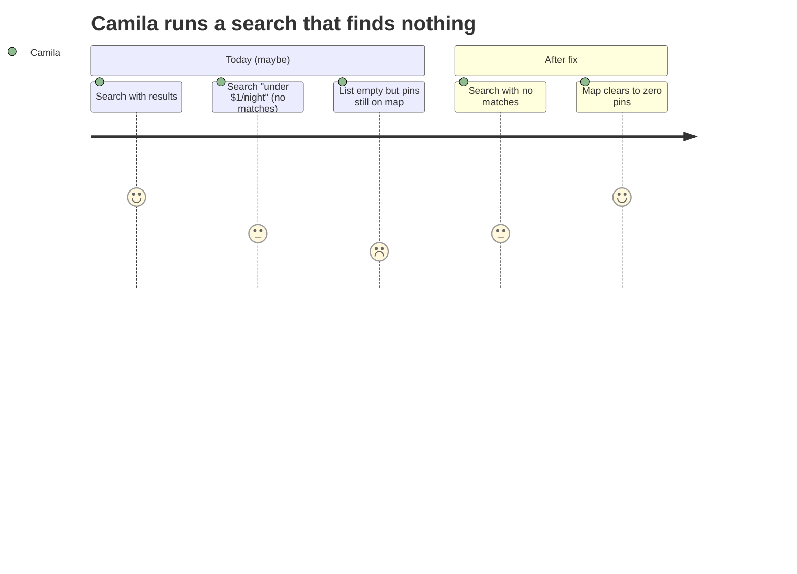
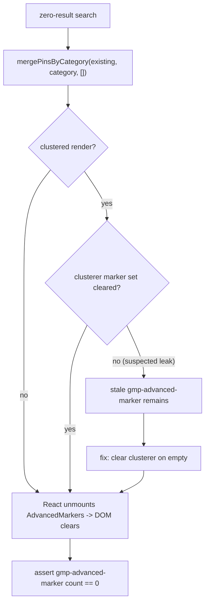

# UX-007 — Clear stale Google AdvancedMarker DOM after empty results

> 🔎 **Verify before you fix.** This was observed in a prior session (F-4) but the current code path (React-managed vis.gl markers via `merge-pins-by-category`) may already clear them. Step 1 is to reproduce against the deployed PR #12 build. If it does **not** reproduce, the deliverable becomes the regression test that locks the correct behavior in — do not invent a fix for a bug that's gone.

## Plain-English problem

When a search returns nothing (e.g. "1BR in Laureles under $1/night"), the results list and the pin count correctly drop to 0. But the actual pins drawn on the Google map can sometimes stay on screen until the page is reloaded. So the map says "here are 5 places" while the list says "no results" — a confusing contradiction.

## User impact

- **Camila** sees pins on the map after being told there are no matches, and can't trust whether the map reflects her current search.
- Becomes more important once concierge pins (cafés/events) come online (UX-001) — stale markers across verticals would be even more confusing.

## Persona affected

**Camila** (rental pins today) and **Tourist** (concierge pins after UX-001).

## Root cause

**SUSPECTED, NOT CONFIRMED on the current build.** Prior-session observation (F-4). Per the codebase map:

- Markers render in `mdeapp/src/components/maps/ChatMap.tsx:77-91` (non-clustered) and `mdeapp/src/components/maps/ClusteredCategoryMarkers.tsx` (clustered).
- Empty results clear state via `mdeapp/src/platform/maps/merge-pins-by-category.ts:11-25` (`mergePinsByCategory(existing, category, [])`), called from `mdeapp/src/components/copilot/search-tool-renders.tsx:45,54-55`.
- Explore note: vis.gl AdvancedMarker children are React-managed and *should* unmount cleanly. So a residual marker would point to a clustering edge case or a marker created outside React's lifecycle. **Confirm which path (clustered vs non-clustered) reproduces, if any.**

## Files likely involved

| File | Role |
|------|------|
| `mdeapp/src/components/maps/ChatMap.tsx` | Non-clustered marker render/unmount |
| `mdeapp/src/components/maps/ClusteredCategoryMarkers.tsx` | Clustering — most likely place a marker outlives its data |
| `mdeapp/src/platform/maps/merge-pins-by-category.ts` | The clear-by-category logic |
| `mdeapp/src/components/copilot/search-tool-renders.tsx` | Where empty results trigger the clear |

## Tech stack involved

Google Maps JS + vis.gl `<AdvancedMarker>` (and the marker-clusterer) · React reconciliation · TypeScript. **Constraint (CLAUDE.md): every `<AdvancedMarker>` must sit under a `<Map mapId=…>`; keep that intact while fixing.**

## Skills to load

`mde-maps` (AdvancedMarker + clusterer lifecycle), `testing` (Playwright DOM assertions), `mde-task-lifecycle`.

## Implementation steps

1. **Reproduce:** on the deployed build, run a search that yields pins, then a zero-result search. Inspect the map DOM for `gmp-advanced-marker` elements. Record whether clustered, non-clustered, or both leak.
2. If it does **not** reproduce → skip to step 5 (write the regression test only).
3. If it reproduces → trace whether the clusterer holds marker references after the data array empties; ensure markers are removed/cleared when the category goes to `[]` (clear the clusterer, not just the React list).
4. Verify across the clustered ↔ non-clustered threshold (clusters form at higher pin counts).
5. Add the Playwright assertion (below) regardless, so the correct behavior is locked.

## Tests required

- **Playwright (e2e):** search with results → assert `gmp-advanced-marker` count > 0; then zero-result search → assert `gmp-advanced-marker` count == 0 (the map DOM, not just the side panel). Run for both the clustered and non-clustered counts if both code paths exist.
- Tie into the existing PR #12 empty-clear gate (`e2e/prod/pr12-pin-clear-prod-gate.spec.ts` exists on the QA branch) so panel-clear and marker-clear are asserted together.

## Acceptance criteria

- [ ] After a zero-result search, `gmp-advanced-marker` DOM count is 0 (no residual pins).
- [ ] Verified for both clustered and non-clustered rendering.
- [ ] Side-panel/pin-count clearing (PR #12) still works.
- [ ] `<Map mapId>` invariant preserved.
- [ ] `npm run floor` exits 0.

## Failure cases to handle

- Clusterer retains a marker after its data is gone → must clear the clusterer's marker set on result-set change.
- Switching categories (rental → café) must clear the previous category's markers but **not** other surviving categories (cross-vertical survival — coordinate with the pin-merge logic).
- Rapid successive searches → no marker accumulation/leak over many queries.

## Rollback plan

Localized to the map render/clear path. Revert the PR to restore prior behavior. The regression test can stay even if the fix is reverted (it documents expected behavior). No data/API change.

## Evidence required before marking Done

- The reproduction result from step 1 (repros / does-not-repro), written in evidence with a DOM marker-count before/after.
- Playwright e2e green (paste output).
- `npm run floor` exit 0.
- **Localhost runtime proof:** screenshot of the map at 0 markers after a zero-result search via `npm run dev`. Save under `tasks/testing/evidence/<date>/`.

## User journey diagram

## Technical flow diagram

## Beginner explanation

The map draws a little pin for each search result. When a search finds nothing, the list empties — but sometimes the pins stay drawn on the map because of how the "clustering" feature (which groups nearby pins) holds onto them. This task checks whether that still happens, and if so, makes sure the pins are wiped whenever the results change, so the map and the list always agree. It also adds an automated test that counts the pins on the map and fails if any are left over.

## Do not overbuild

- **Do not** swap map libraries or rewrite the marker system.
- **Do not** add manual "clear map" buttons — clearing should be automatic on result change.
- **Verify first** — if the current build already clears correctly, ship only the regression test; don't manufacture a fix.
- Preserve cross-vertical pins (don't clear café pins when rentals clear) and the `mapId` rule.
