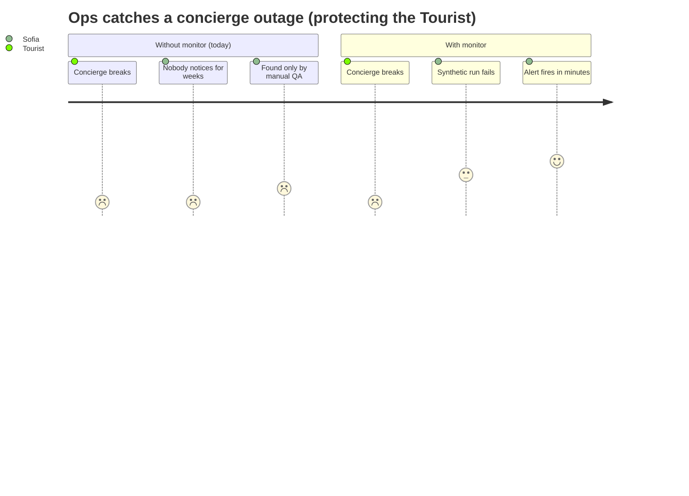
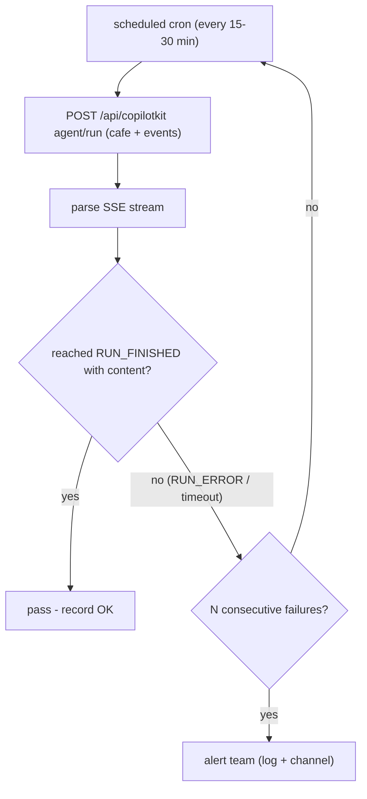

# UX-009 — Add a production synthetic monitor for conciergeAgent

> ⛓️ **Depends on UX-001.** Until the concierge is restored, this monitor will (correctly) alarm. That's fine — it becomes the green/red signal that proves UX-001 holds over time.

## Plain-English problem

The entire concierge being dead on prod was **invisible** until a human ran a manual QA pass. There is no automated check that the AI actually answers in production. We need a scheduled "synthetic user" that asks the concierge a question on prod and raises an alarm if it fails.

## User impact

- Indirectly protects the **Tourist**: the next time the concierge breaks, the team finds out from an alert in minutes — not from a user (or a quarterly QA) discovering a silent outage.
- Closes the gap that let F-1 ship unnoticed.

## Persona affected

**Tourist** (the persona whose features the monitor guards). Operator: **Sofía** (dev/ops) receives the alert.

## Root cause

**KNOWN (missing observability).** Per the codebase map: there is **no `e2e/prod/` directory** on the active branch and **no CI/cron schedule** (`.github/workflows`, `vercel.json` crons) for smoke tests. `package.json` has 7 manual `smoke:*` scripts (`smoke:f50-pin-sync`, `smoke:grounding-attribution`, `smoke:lead-capture`, `smoke:map-pins`, `smoke:search-grounding`, `smoke:ticket-checkout`, `smoke:ticket-paid-proof` — re-verified 2026-05-30) but none is scheduled and none covers conciergeAgent. A concierge smoke would live at `mdeapp/e2e/concierge-agent-smoke.spec.ts`.

## Files likely involved

| File | Role |
|------|------|
| `mdeapp/e2e/concierge-agent-smoke.spec.ts` (**new**) or a script `scripts/smoke/concierge.ts` | Issues a real `POST /api/copilotkit` `agent/run` against prod and asserts `RUN_FINISHED` (not `RUN_ERROR`) with content |
| `mdeapp/package.json` | Add a `smoke:concierge` script alongside the existing `smoke:*` |
| Schedule + alert wiring — **one of:** Vercel Cron in `vercel.ts`/`vercel.json` hitting a guarded `/api/_smoke/concierge` route, **or** a scheduled GitHub Actions workflow running `smoke:concierge` against `SMOKE_BASE_URL=https://www.mdeai.co` | Periodic execution + failure notification |

## Tech stack involved

Vercel (Cron jobs / monitoring) **or** GitHub Actions (scheduled workflow) · the AG-UI SSE stream (`RUN_STARTED`/`RUN_FINISHED`/`RUN_ERROR`) · Playwright or a thin fetch+SSE-parse script · Mastra concierge endpoint · a notification sink (log/Slack/email). Pick the schedule mechanism that matches existing ops via the `mde-vercel` skill.

## Skills to load

`mastra-smoke-test` (smoke pattern for the agent), `mde-vercel` (Cron jobs + env + alerting), `testing` (assertion + SSE parsing), `mde-task-lifecycle`.

## Implementation steps

1. Write the smoke: send `POST /api/copilotkit` `agent/run` for "Quiet cafés near Laureles" (and an events prompt) against the prod base URL; parse the SSE; **pass** only if the stream reaches `RUN_FINISHED` with assistant content within a sane timeout; **fail** on `RUN_ERROR`/`INCOMPLETE_STREAM`/timeout.
2. Add `smoke:concierge` to `package.json` (mirrors the existing `smoke:*` scripts, parameterized by `SMOKE_BASE_URL`).
3. Choose + wire the schedule (recommend Vercel Cron → a guarded internal smoke route, since the platform is Vercel and it keeps secrets server-side; GitHub Actions is the fallback if cron-on-Vercel isn't desired). Run every ~15–30 min.
4. Wire a failure alert (at minimum a logged error + a notification to the team channel).
5. Reuse this exact smoke as the **acceptance gate for UX-001** (so the fix and its monitor share one definition of "concierge works").

## Tests required

- **The monitor itself is the test.** Validate it two ways:
  - **True-negative:** point it at the current (broken) prod or a mocked `RUN_ERROR` stream → it must **fail/alert**.
  - **True-positive:** point it at a healthy run (post-UX-001, or a mocked `RUN_FINISHED` with content) → it must **pass**.
- **Local dry-run:** `smoke:concierge` runnable locally against `SMOKE_BASE_URL` without committing secrets.

## Acceptance criteria

- [ ] `smoke:concierge` exists and exercises a real concierge `agent/run`.
- [ ] It fails on `RUN_ERROR`/`INCOMPLETE_STREAM`/timeout and passes only on `RUN_FINISHED` + content.
- [ ] It runs on a schedule in prod and emits an alert on failure.
- [ ] Verified true-negative (alarms on the broken state) and true-positive (passes when healthy).
- [ ] No secrets committed; `npm run floor` exits 0.

## Failure cases to handle

- Flaky single failure vs real outage → require N consecutive failures (or 2-of-3) before paging, to avoid alert fatigue.
- The smoke must not pollute prod analytics/data (use a clearly-tagged synthetic thread/resource id, and don't write leads/tickets).
- Auth/rate limits on the endpoint → ensure the synthetic is allowed without weakening real security.
- Timeout chosen sanely vs `maxDuration` so a slow-but-OK run isn't flagged.

## Rollback plan

Additive observability. Disable the cron/workflow or revert the PR to remove the monitor. No effect on the app runtime or the rental path.

## Evidence required before marking Done

- Output of the true-negative run (alarms on broken/mocked `RUN_ERROR`) and the true-positive run (passes on healthy/mocked `RUN_FINISHED`).
- Proof the schedule is live (Vercel Cron config or the GH Actions schedule) + a sample alert.
- `npm run floor` exit 0.

## User journey diagram

## Technical flow diagram

## Beginner explanation

A "synthetic monitor" is a robot that pretends to be a user. Every 15–30 minutes it asks the concierge "Quiet cafés near Laureles" on the real website and checks that it gets a real answer. If the answer never comes (the same failure real users hit), the robot raises an alarm so the team fixes it fast — instead of finding out weeks later. We build the robot's check once and reuse it as the proof that UX-001's fix actually works.

## Do not overbuild

- **Do not** build a full monitoring platform/dashboard — one scheduled check + one alert is the MVP.
- **Do not** synthetic-test every vertical exhaustively; café + events covers the conciergeAgent path.
- **Do not** let the synthetic write real data (leads, tickets, analytics) — tag it and keep it read-only.
- Reuse the existing `smoke:*` script pattern rather than inventing a new harness.
