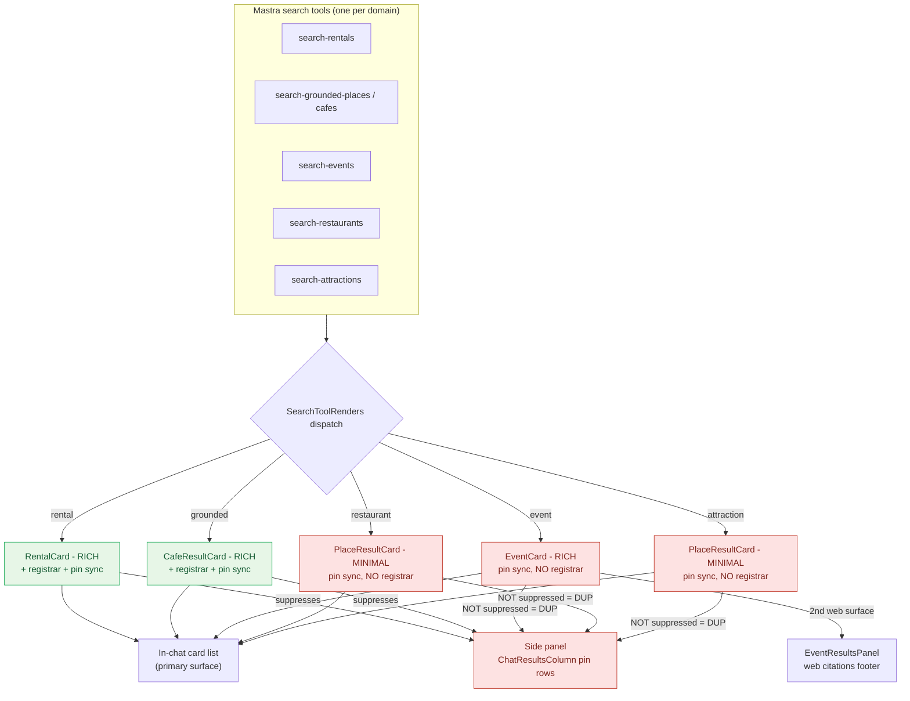
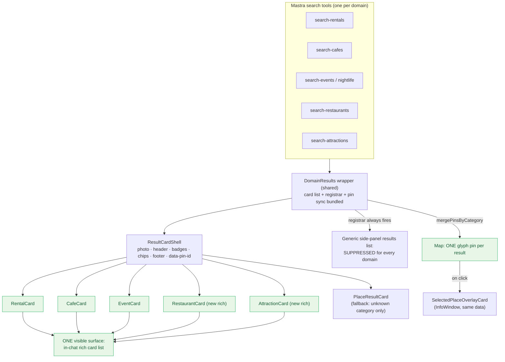
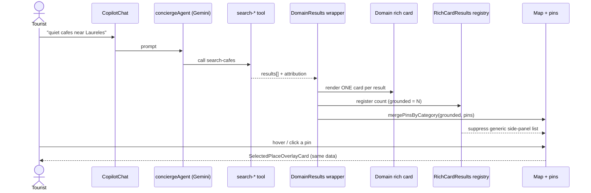
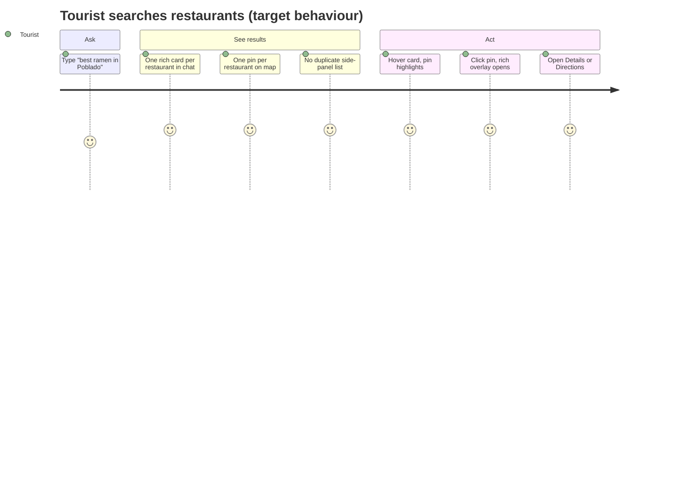

# UX-010 — Unified result-card architecture

> **The bar (from the request):** audit the result-card system for **rentals, cafés, restaurants, nightlife, attractions, events**, then converge on one rule:
>
> **one result = one rich card + one map pin — no duplicate cards, lists, or panels — rich cards for every known domain.**

## 0. TL;DR (read this first)

The café de-dup work on `feat/c012-cafe-places-detail` already proves the *target* pattern for one domain. The problem is it was wired **per-domain by hand**, so only **rentals + cafés** got the full treatment. **Events, restaurants, and attractions still double-render** (a card in chat **and** a pin-row in the side panel), and restaurants/attractions are still **minimal** cards.

- **Root cause (one line):** `RICH_CARD_CATEGORIES` lists 5 domains, but only `rental` and `grounded` actually mount `<RichCardResultsRegistrar>`. The suppression check (`shouldSuppressGenericMapResults`) therefore **never fires** for events / restaurants / attractions → their entities render twice.
- **"Nightlife" is not a domain.** It is an *event* category (`event-discovery-workflow.ts`) and a rental amenity tag. Nightlife results render through `EventCard` / pin as `event`. No new map-pin category needed.
- **The fix is structural, not cosmetic:** bundle "card list + registrar + pin sync" into one shared wrapper so a domain **physically cannot** be wired with pins-but-no-registrar (today's exact bug), build all rich cards on one shared shell, and demote the side-panel list.

System UX today ≈ **63/100** (rentals/cafés great, events mediocre, restaurants/attractions poor). Target ≈ **90+/100** across the board.

## 1. Beginner explanation (no jargon)

Picture the Tourist on `/` asking *"best ramen in Poblado."* The right answer is: **a stack of pretty cards in the chat** (photo, rating, buttons) and **a matching dot for each one on the map.** One restaurant = one card = one dot. Hover a card, its dot lights up. Click a dot, a little card pops up on the map.

Right now that only works cleanly for **rentals** and **cafés**. For **restaurants, attractions, and events**, the same restaurant shows up **twice**: once as a card in the chat, and *again* as a plain text row in a "Map results" strip lower down. And for restaurants/attractions the card is the **boring** version (just a title + a link), not the pretty one.

Why? Because each domain was wired up by hand, and three of them were given "show a pin" but forgotten the "...and hide the duplicate list" half. This doc makes that impossible to forget by gluing the two halves together, and gives every domain the pretty card.

## 2. Audit — per-domain findings

Surface: concierge chat at `/` (the `/chat` path redirects home). Dispatch: `src/components/copilot/search-tool-renders.tsx`. Map pins: `ToolPinsSync` → `mergePinsByCategory`. Side panel: `ChatResultsColumn` inside `CenterPanelMapResultsSlot`.

| # | Domain | Card component | Rich/minimal | Duplicate render? | Pin↔card 1:1? | Grounding/source dup? | Side-panel dup? | UX /100 |
|---|--------|----------------|--------------|-------------------|---------------|----------------------|-----------------|---------|
| 1 | **Rentals** | `RentalCard` | **Rich** | No | Yes | N/A (no grounding) | **No** — suppressed via registrar | **92** |
| 2 | **Cafés** | `CafeResultCard` | **Rich** | No *(branch only)* | Yes | No — `GroundingAttribution` orphaned; footer link per card | **No** — suppressed via registrar | **90** |
| 3 | **Events** | `EventCard` | **Rich** | **Yes** — card + side-panel pin row | Yes | Partial — web citations appear **inline (chat)** *and* in `EventResultsPanel` footer | **Yes** — no registrar | **62** |
| 4 | **Restaurants** | `PlaceResultCard` | **Minimal** | **Yes** — card + side-panel pin row | Yes | N/A | **Yes** — no registrar | **46** |
| 5 | **Attractions** | `PlaceResultCard` | **Minimal** | **Yes** — card + side-panel pin row | Yes | N/A | **Yes** — no registrar | **46** |
| — | **Nightlife** | *(none — it's an event facet)* | Inherits `EventCard` | inherits events | inherits events | inherits events | inherits events | **n/a → 62** |

**Weighted system score ≈ 63/100.**

### 2.1 The single root cause

```ts
// src/platform/copilot/rich-card-results.ts
export const RICH_CARD_CATEGORIES =
  ["rental", "event", "restaurant", "attraction", "grounded"] as const;

export function shouldSuppressGenericMapResults(counts, activeMapCategory) {
  if (activeMapCategory && (counts[activeMapCategory] ?? 0) > 0)
    return isRichCardCategory(activeMapCategory);
  return false; // ← counts[event|restaurant|attraction] is ALWAYS 0
}
```

…but in `search-tool-renders.tsx` only two domains push a count:

| Domain | `<ToolPinsSync>` (pin) | `<RichCardResultsRegistrar>` (suppress) |
|--------|:----------------------:|:---------------------------------------:|
| grounded (café) | ✅ L131 | ✅ L129 |
| rental | ✅ L213 | ✅ L211 |
| event | ✅ L343 | ❌ **missing** |
| restaurant | ✅ L596 | ❌ **missing** |
| attraction | ✅ L615 | ❌ **missing** |

> Line numbers re-verified on disk 2026-05-30 (branch `feat/c012-cafe-places-detail`); the file grew since authoring — restaurant/attraction moved from L442 → L596/L615. The **gap itself is unchanged**: only `grounded` + `rental` mount the registrar.

So events/restaurants/attractions emit a pin (→ side-panel row) but never register a count (→ never suppressed). That is the duplicate.

### 2.2 Secondary findings (cleanup debt)

- **Orphaned components (no JSX importer):** `GroundingAttribution.tsx` (the old "Maps grounding" list) and `grounded-place-card.tsx` (predecessor of `CafeResultCard`). Both still ship + carry tests.
- **Dead helpers:** `shouldShowGroundingAttribution` / `dedupeAttributionForDisplay` in `parse-grounded-tool-result.ts` are referenced **only by their own test** now that `GroundingAttribution` is unmounted.
- **Events have two web-citation surfaces:** inline `WebCitationList` in the chat tool render (`search-tool-renders.tsx:399`) **and** `EventResultsPanel` footer (`chat-center-panel.tsx:46`, fed by `EventWebCitationSync`/`Fetch`). Not a card duplicate, but a second "sources" surface to collapse.
- **Pin de-dup is already correct:** `mergePinsByCategory` replaces a category's pins wholesale and de-dupes by `placeId ?? id`; `ClusteredCategoryMarkers` renders exactly one marker per pin. The map side is healthy — the duplication is entirely in the **side panel + minimal cards**.
- **Map overlay is not a duplicate:** clicking a pin opens `SelectedPlaceOverlayCard` in an `InfoWindow` (the Mindtrip pattern). That is the map-side detail of the *same* entity, shown on demand — keep it.

## 3. Architecture — current vs. target

### 3.A Current state (the problem)



### 3.B Target architecture (the best setup)



The three guarantees, enforced by structure:

1. **One rich card** — every domain renders through `ResultCardShell`; `PlaceResultCard` survives only as the unknown-category fallback.
2. **One pin** — `mergePinsByCategory` (already 1:1) stays; the shared wrapper owns pin sync so card `data-pin-id` and pin `id` are produced by the same builder.
3. **No duplicate surface** — the wrapper *always* registers a rich-card count, so `shouldSuppressGenericMapResults` fires for every domain; the side-panel results list stops being a parallel list.

## 4. Rendering flow (one search)



## 5. User journey (target)



## 6. Recommended architecture (specifics)

### 6.1 `ResultCardShell` (new — `src/components/copilot/result-card-shell.tsx`)
Extract the skeleton already shared by `RentalCard` / `CafeResultCard` / `EventCard`:

```
<article data-result-kind data-pin-id onMouseEnter/onFocus={preview}>
  <Media>           // photo (proxy) OR category-glyph placeholder + attribution
  <Header>          // rank/badge · title · rating line
  <BadgeRow>        // type · price · open-now · availability (domain-supplied)
  <Body>            // blurb / matchReason / address (1 slot)
  <ChipRow?>        // verification chips (grounded only)
  <Footer>          // map links (Directions/Reviews/Maps) + domain CTAs (Details/Buy/Request)
</article>
```
Domain cards pass typed props + their CTA set; the shell owns layout, `data-pin-id`, hover→`panToPin`, selected-state ring, and graceful empty-field degradation (mirrors `SelectedPlaceOverlayCard`).

### 6.2 `DomainResults` wrapper (new — closes the bug for good)
One component that every domain render uses:

```tsx
<DomainResults
  category="restaurant"     // MapPinCategory
  result={result}           // raw tool payload
  rows={rows}               // normalized
  renderCard={(row) => <RestaurantCard {...row} />}
  emptyState={<GenericEmptyState .../>}
/>
// internally renders, in order:
//   <ToolPinsSync category={category} result={result} />
//   <RichCardResultsRegistrar category={category} count={rows.length} />
//   rows.map(renderCard)   // with scroll-into-view on selectedPinId
```
Because pins + registrar live in the same component, **you cannot ship pins without suppression again.**

### 6.3 New rich domain cards
- `RestaurantCard` — photo, rating, cuisine/price/open-now badges, blurb, Directions/Reviews + Details. (Restaurant tool already supplies place fields; reuse `places-display` formatters.)
- `AttractionCard` — same shell, attraction-appropriate badges (type, hours), Directions + Details.
- `CafeCard` — rename/keep `CafeResultCard` as a shell consumer.
- `PlaceResultCard` — retain **only** as `DomainResults` fallback when a category has no dedicated card.

### 6.4 Side panel + grounding
- **Demote** `ChatResultsColumn` / `CenterPanelMapResultsSlot`: it must not be a parallel results list. Either remove it or repurpose strictly as empty/loading affordance. The in-chat card list is the single visible result surface; the map (+ `SelectedPlaceOverlayCard`) is the spatial view.
- **Grounding = footer only:** delete orphaned `GroundingAttribution` + `grounded-place-card.tsx` + dead `shouldShowGroundingAttribution`/`dedupeAttributionForDisplay`; the per-card footer already carries the Maps link. Keep `sanitizeAssistantChatContent` as defense-in-depth against model-echoed lists.
- **Events:** collapse the two web-citation surfaces into one footer (`EventResultsPanel`); drop the inline `WebCitationList` in the event tool render (or vice-versa — pick one).

### 6.5 Nightlife decision
Keep nightlife as an **event facet** (recommended): zero new pin category, inherits `EventCard` + `event` pin automatically. Only add a `nightlife` `MapPinCategory` if product wants a distinct glyph/colour — not required for this work.

## 7. Implementation plan & migration order

Ordered for **safety** (rentals + the working café flow stay visually identical until the very end) and **highest-impact-first** (the duplicate dies in M1).

| Step | Scope | Risk | Persona win |
|------|-------|------|-------------|
| **M0** | Extract `ResultCardShell`; refactor `RentalCard`/`CafeResultCard`/`EventCard` onto it. **Pure refactor — snapshots unchanged.** | Low | none yet (foundation) |
| **M1** | Add `DomainResults` wrapper; route **events + restaurants + attractions** through it → side-panel dup vanishes for them. **Highest impact.** | Low–Med | Tourist stops seeing every place twice |
| **M2** | `RestaurantCard` (rich) on the shell; swap restaurant render. | Med | restaurants look like cafés |
| **M3** | `AttractionCard` (rich) on the shell; swap attraction render. | Med | attractions look like cafés |
| **M4** | Cleanup: delete `GroundingAttribution`, `grounded-place-card.tsx`, dead helpers; collapse event web-citations to one footer; demote/remove `ChatResultsColumn` results list. | Med | cleaner chat, smaller bundle |
| **M5** | Lock-in: unit + registry + pin-parity tests, per-domain Playwright "one card + one pin + no dup panel", floor green. | Low | Sofía/Lucía catch regressions |

**Sequencing note:** land on top of (or after) `feat/c012-cafe-places-detail` so M0's `CafeResultCard` refactor doesn't conflict with the in-flight café branch. One worktree, one PR per `mde-worktree-pr-flow`.

## 8. Risks & failure points

1. **Map-sync regression** — refactoring card/pin id wiring could break hover-highlight + scroll-into-view + overlay. *Mitigation:* single `pinId` builder per domain; assert `data-pin-id` == pin `id` parity in tests (§9).
2. **Suppression hides the *only* surface** — if a registry count sticks `>0` after results clear, the card list could be suppressed with nothing to show. *Mitigation:* registrar cleanup already sets 0 on unmount; add an explicit "clears on new/empty search" test.
3. **Sparse tool payloads** — restaurant/attraction results may lack photo/rating → rich card looks empty. *Mitigation:* shell degrades gracefully (glyph placeholder, hide empty rows), exactly as `SelectedPlaceOverlayCard` already does.
4. **Branch conflict** — café branch is undeployed; building M0 on `main` then merging café could collide on `CafeResultCard`. *Mitigation:* base this work on the café branch or merge it first (needs approval — not done here).
5. **Nightlife expectation mismatch** — request lists nightlife as a domain; it's events. *Mitigation:* documented in §6.5; default keeps it as an event facet.
6. **Don't redesign rentals** — RentalCard is the 92/100 reference. *Mitigation:* M0 is a non-visual extraction; rental snapshot must be byte-identical.

## 9. Test plan

- **Unit** — `ResultCardShell` renders each slot + degrades on missing fields; each domain card maps its props; `PlaceResultCard` still renders as fallback.
- **Registry** — `shouldSuppressGenericMapResults` returns `true` for **every** `RICH_CARD_CATEGORY` once `DomainResults` mounts; returns `false`/clears when rows empty.
- **Pin parity (the 1:1 invariant)** — for each domain: `cards.length === pins.length === markers.length`, and every card `data-pin-id` has a matching pin `id`.
- **Sanitizer** — existing `sanitize-assistant-chat-content.test.ts` stays green (model-echoed "Maps grounding"/place lists stripped).
- **E2E (Playwright, localhost `/`)** — per domain (rental, café, restaurant, attraction, event): exactly **1** `article` per result, **0** `[data-testid="results-pin-row"]`, **1** marker per result, hover→highlight, click→overlay, clean prose, no console errors.
- **Floor** — `npm run floor` exits 0 with the new tests (lint → typecheck → build → test → audit).

## 10. Acceptance criteria

- [ ] Every known domain — rentals, cafés, restaurants, attractions, events (incl. nightlife) — renders a **rich** card. `PlaceResultCard` appears only for unknown categories.
- [ ] For any single search, each result appears **once** on screen (1 chat card), with **exactly 1** map pin, and **0** duplicate side-panel / list / grounding rows.
- [ ] Card↔pin parity holds (`data-pin-id` == pin `id`); hover highlights the pin; click opens `SelectedPlaceOverlayCard`.
- [ ] `GroundingAttribution`, `grounded-place-card.tsx`, and the dead grounding helpers are removed; events expose **one** web-sources footer.
- [ ] Rentals output is visually unchanged (snapshot parity) — **no redesign**.
- [ ] `npm run floor` exits 0; per-domain localhost runtime proof captured under `tasks/testing/evidence/<date>/` per the CLAUDE.md Done gate.

## 11. Do NOT overbuild (scope guard)

- **No new map-pin category** unless product explicitly wants a distinct nightlife glyph. Nightlife = events.
- **No rental redesign.** RentalCard is the reference; only adapt it to consume the shared shell with identical output.
- **No Save/Trips functionality** — those buttons stay disabled. (Tooltip *copy* is owned by **UX-008/SAN-324**, which replaces the internal "SCREEN-011" string with user-facing "Saving is coming soon" — do not re-introduce the ticket name here.)
- **No backend/tool-schema changes** — this is a render-layer convergence. Tool payloads are consumed as-is.
- **No v2 CopilotKit** — stay on pinned 1.55.2; v1 imports only.
- This is a **render unification**, not a re-architecture of search, Mastra, or the map engine.

## 12. Evidence / provenance

- Audit performed 2026-05-29 against `feat/c012-cafe-places-detail @ 895f459` by reading: `search-tool-renders.tsx` (dispatch), all five card components, `rich-card-results.ts`, `rich-card-results-context.tsx`, `chat-results-column.tsx`, `center-panel-map-results-slot.tsx`, `chat-center-panel.tsx`, `GroundingAttribution.tsx`, `event-results-panel.tsx`, `event-search-results-context.tsx`, `parse-grounded-tool-result.ts`, `merge-pins-by-category.ts`, `active-map-category.ts`, `category-map-marker.ts`, `ClusteredCategoryMarkers.tsx`, `MapPinInfoWindow.tsx`, `SelectedPlaceOverlayCard.tsx`, plus grep confirmation of registrar/pin wiring and orphan status.
- Café single-domain proof that this pattern works: [`cafe-rich-card-dedup-runtime-proof.md`](../testing/evidence/2026-05-29/cafe-rich-card-dedup-runtime-proof.md).
- All four diagrams above validated via the mermaid validator (`valid: true`).
