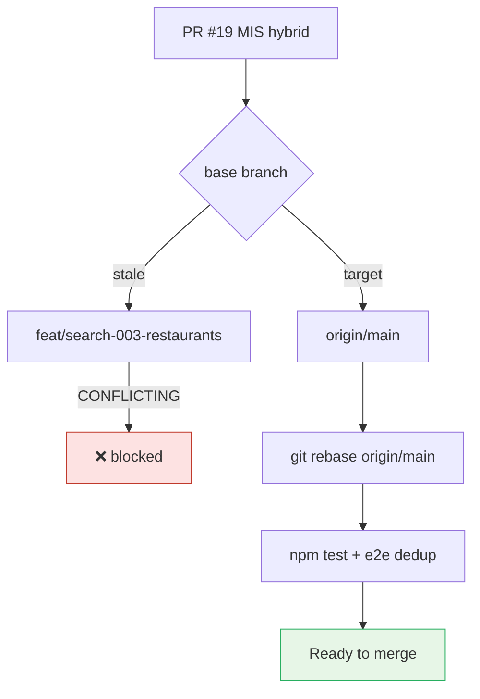

# UX-017 — Rebase PR #19 onto `main`

## Plain-English problem

PR #19 has good code (348 tests, golden 8/8) but GitHub shows **CONFLICTING** because base branch `#18` already merged to `main`. Cannot merge until rebase.

## User impact

- **Camila:** rental + event hybrid search blocked in prod.
- **Sofía:** stack hygiene failure — should have rebased when #18 merged.

## Root cause

**KNOWN (audit M1/M2).** Base `feat/search-003-restaurants` stale; conflict files include `search-restaurants.ts`, `search-grounded-places.ts`, `concierge.ts`, `package.json`.

## Workflow

1. `git fetch origin && git checkout feat/mis-rental-event-search`
2. `git rebase origin/main`
3. Resolve conflicts — prefer #19 intelligence modules + main’s merged SEARCH-003 + UX P0 fixes.
4. `npm test` → expect pass count ≥ main baseline.
5. `npm run test:e2e e2e/rich-card-dedup.spec.ts` (script exists on main).
6. Force-push rebase; change PR base to `main` in GitHub UI.
7. Optional: restore `scripts/intelligence/golden-queries-smoke.ts` from #19 branch as follow-up — **not on main today**.

## Acceptance criteria

- [ ] PR #19 mergeable clean against `main`.
- [ ] `npm test` green post-rebase.
- [ ] `npm run test:e2e e2e/rich-card-dedup.spec.ts` green (existing — no golden-queries script on main).
- [ ] PR base branch = `main` in GitHub.
- [ ] Merge only after UX-015 (#17) and UX-013/014 on main.

## Flow diagram

## Verification (2026-05-31)

| Claim | Result |
|-------|--------|
| golden-queries-smoke on disk | 🔴 Missing on main |
| rich-card-dedup e2e | ✅ exists |
| Merge conflict | 🔴 Expected until rebase |
