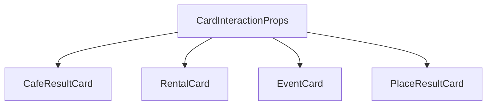

# UX-020 — CardInteractionProps + shared types

## Purpose

Single source of truth for map-sync props (`pinId`, `onSelect`, `onOpenDetails`, `selected`, `testId`, `resultKind`) used by all search result cards.

## Affected files

| Action | Path |
|--------|------|
| Create | `mdeapp/src/components/cards/card-interaction-props.ts` |
| Modify | `cafe-result-card.tsx`, `rental-card.tsx`, `event-card.tsx`, `place-result-card.tsx` — extend type (no behavior change yet) |

## Implementation

1. Add types per strategy §3.
2. Export `DEFAULT_TEST_IDS` map per `ResultKind`.
3. Re-export from `components/cards/index.ts` if barrel exists; else direct imports.

## Tests

- Vitest: type-only compile + optional runtime helper `defaultTestId(kind)`.

## Acceptance

- [ ] All five cards import `CardInteractionProps` (or extend it).
- [ ] No runtime behavior change in this task alone.
- [ ] `npm run floor` green.

## Flow diagram

## Verification (2026-05-31)

| Claim | Result |
|-------|--------|
| Shared type exists | ❌ Not yet — create in this task |
| Blocks UX-023 | ✅ Correct dependency |
