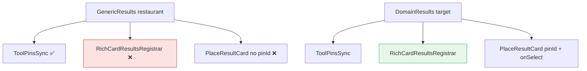

# UX-022 — DomainResults wrapper (P0 ship blocker)

## Purpose

Close the structural bug: restaurant/attraction searches show **duplicate side-panel rows** and cards **cannot highlight map pins**.

## Root cause (verified on disk)

`GenericResults` (`search-tool-renders.tsx` ~418):

- ✅ `ToolPinsSync`
- ❌ No `RichCardResultsRegistrar`
- ❌ `PlaceResultCard` rendered without `pinId`, `selected`, `onSelect`

Compare `RentalResults` / `GroundedCafeResults` / `EventResults` — all three pass `selectedPinId`, `panToPin`, registrar.

## Affected files

| Action | Path |
|--------|------|
| Create | `mdeapp/src/components/copilot/domain-results.tsx` |
| Modify | `search-tool-renders.tsx` — route restaurant/attraction through wrapper; **pass `pinId`/`selected`/`onSelect` at the `GenericResults` call site (~L448)** |
| No change | `place-result-card.tsx` — **already accepts `pinId`/`selected`/`onSelect` (L7-9, `interactive = Boolean(onSelect && pinId)`).** The gap is the caller omitting them, not a missing prop. |
| Test | `domain-results.test.tsx`, update `rich-card-results` tests |

## DomainResults API

```tsx
<DomainResults
  category="restaurant"
  result={result}
  rows={rows}
  renderCard={(row, ctx) => (
    <PlaceResultCard
      pinId={ctx.pinId}
      selected={ctx.selected}
      onSelect={ctx.onSelect}
      ...
    />
  )}
  emptyState={<GenericEmptyState category="restaurant" ... />}
/>
```

Internally: `ToolPinsSync` + `RichCardResultsRegistrar` + scroll-into-view on `selectedPinId` + list ref.

**Verified gap:** `GenericResults` @ `search-tool-renders.tsx:418` — pins only, no registrar, no `pinId`/`onSelect` on cards.

## Flow diagram



## Verification (2026-05-31)

| Claim | Result |
|-------|--------|
| Event has registrar | ✅ L343 (not broken) |
| Restaurant/attraction registrar | 🔴 Missing — `GenericResults` L418 has `ToolPinsSync` only, no registrar |
| `PlaceResultCard` pin props exist | ✅ Component accepts `pinId`/`selected`/`onSelect` (L7-9) — caller at ~L448 omits them |
| Cafe/rental pattern | ✅ Reference implementation (grounded:129, rental:211, event:343) |

## Tests

- Vitest: mounting DomainResults registers count → `shouldSuppressGenericMapResults(true)`.
- Vitest: unmount clears count.
- Vitest: each row gets unique `data-pin-id`.

## Acceptance

- [ ] Restaurant search: 0 duplicate side-panel pin rows when cards visible.
- [ ] Click/hover card highlights matching map pin.
- [ ] Pin click scrolls card into view.
- [ ] Attraction path identical.
- [ ] Event/rental/café behavior unchanged.
- [ ] `npm run floor` green.
- [ ] Browser evidence: restaurant query on `/`.

## Dependencies

**UX-014** — agent path must emit tool results to UI; wrapper fixes fast-path/render-path sync only.
