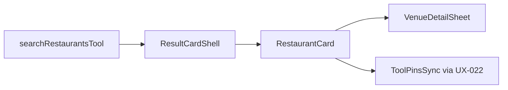

# UX-025 — RestaurantCard rich (M2)

## Purpose

Tourist asking "best ramen Poblado" gets café-quality cards, not title + plain link.

## Affected files

| Create | Modify |
|--------|--------|
| `restaurant-card.tsx` | `search-tool-renders.tsx` restaurant branch |
| | `domain-results.tsx` renderCard |
| | Reuse `places-display` formatters, `placesPhotoProxyUrl` |

## Data source

Consume existing restaurant tool payload fields (place_id, rating, photo, price_level, open_now) — **no tool schema change**.

## Detail panel

Minimum: `VenueDetailSheet` with place summary + Maps links. Full Places enrichment optional follow-up.

## Tests

- Vitest: maps sparse payload → glyph placeholder, no crash.
- Vitest: full payload → photo + Badge price + rating line.
- Playwright: restaurant query → N rich cards, 0 side-panel dup.

## Acceptance

- [ ] Restaurant branch renders `RestaurantCard`, not bare `PlaceResultCard`.
- [ ] Details CTA opens panel/sheet.
- [ ] Map pin sync via UX-022 contract.
- [ ] `npm run floor` green + browser evidence.

## Flow diagram

## Verification (2026-05-31)

| Claim | Result |
|-------|--------|
| Depends UX-022 | ✅ pin sync prerequisite |
| Depends UX-023 | ✅ shell prerequisite |
| PlaceResultCard today | 🔴 minimal — 3/10 audit score |
