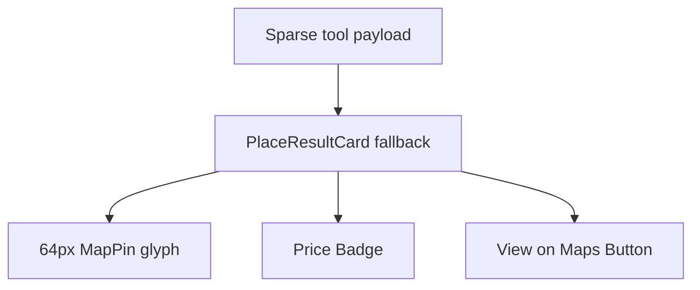

# UX-028 — PlaceResultCard fallback upgrade

## Purpose

Bridge quality gap for unknown/sparse categories and interim restaurant path.

## Changes

- 64×64 `bg-muted` + `MapPin` icon placeholder
- `priceLabel` → `<Badge variant="outline">`
- Maps link → `<Button size="sm" variant="outline">View on Maps</Button>`
- `overflow-hidden` on root
- Optional `onOpenDetails` for future panel

## Acceptance

- [ ] Fallback card visually closer to café cards.
- [ ] Used only when no domain-specific card (document in comment).
- [ ] Tests updated.

## Flow diagram

## Verification (2026-05-31)

| Claim | Result |
|-------|--------|
| Interim until UX-025 | ✅ Correct scope |
| Required testId today | 🔴 no default — fix in UX-021 |
