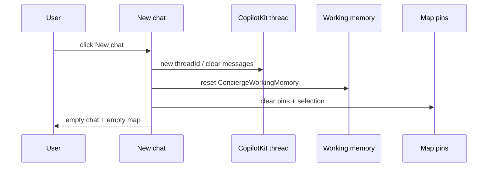

# UX-032 — New chat reset (from UX-006)

## Purpose

**Camila** finishes a rental search, clicks New chat, expects a clean slate — today she keeps old pins, filters, and messages.

## Root cause (verified)

`chat-nav-rail.tsx:24-30` — client nav to `/` without clearing:

- CopilotKit thread / messages
- `useCoAgent<ConciergeWorkingMemory>()` state
- Map pins (`useMapContext`)
- Rich card registrar counts

## Files

| File | Change |
|------|--------|
| `src/components/chat/chat-nav-rail.tsx` | Reset handler vs bare Link |
| `src/components/chat/chat-center-panel.tsx` | Wire reset callback |
| `src/platform/maps/map-context.tsx` | Clear pins API |
| `src/components/chat/rich-card-results-context.tsx` | Reset counts |

## Acceptance

- [ ] New chat → empty message list, zero pins, cleared working memory filters.
- [ ] Rental fast-path still works on next message.
- [ ] Playwright or manual evidence in `tasks/testing/evidence/<date>/`.

## Flow diagram

## Verification (2026-05-31)

| Claim | Result |
|-------|--------|
| Still Link only | 🔴 confirmed |
| UX-006 parent spec | Accurate — still needed |
