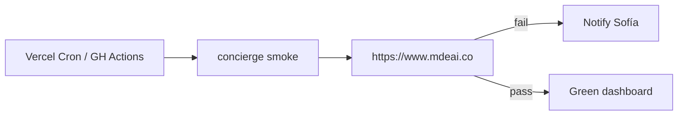

# UX-034 — Prod synthetic concierge monitor (from UX-009)

## Purpose

**Sofía** gets paged when prod concierge breaks — not **Tourist** discovering silence first.

## Gap (verified)

- No `e2e/concierge-agent-smoke.spec.ts`
- No Vercel cron / GitHub scheduled workflow for concierge
- Existing `smoke:*` scripts are manual only (`package.json`)

## Implementation options

| Option | Pros |
|--------|------|
| Playwright against prod URL | Full UI path |
| Vercel Cron + `curl` POST `/api/copilotkit` | Lightweight |
| Extend UX-031 matrix as CI scheduled job | Reuses scenarios |

## Acceptance

- [ ] Scheduled run ≥1/day against prod (or preview with prod-like env).
- [ ] Alert on RUN_ERROR / empty stream / non-200.
- [ ] Document runbook in task evidence.

## Flow diagram

## Verification (2026-05-31)

| Claim | Result |
|-------|--------|
| UX-001 same-origin fix | ✅ prerequisite met |
| Monitor exists | ❌ not implemented |
| Depends UX-015 | 🟡 stable error path helps debug failures |
